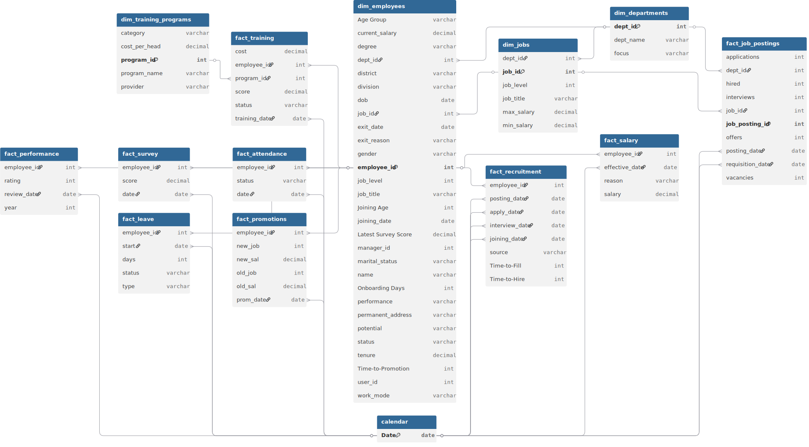

# 📊 Project Background: Workplace Intelligence at BanglaBazaar

BanglaBazaar.com is a leading e-commerce enterprise in Bangladesh, currently employing over **1,100 professionals** across diverse functions including Logistics, Technology, and Sales. As the company scales toward a potential IPO, the "Human Capital" element has shifted from a support function to a primary strategic lever.

This project focuses on **Workplace Intelligence**—moving beyond basic headcount reporting to understand the "Silent Attrition" and "Value Leakage" within the organization. While our overall turnover remains stable, we identified critical vulnerabilities in how we retain our most expensive and high-potential talent. This analysis serves as a roadmap for the Executive Leadership Team to transition from reactive hiring to a **Retention-First** talent strategy.

Insights and recommendations are provided on the following key areas:

* **The Legacy Tax Paradox** (Managing the 15–20% Tenure Pay Gap)
* **The Level 4 Bottleneck** (Fixing the 25% Female Leadership Drop-off)
* **The Sourcing Single Point of Failure** (Mitigating the 45% Sourcing Channel Risk)
* **The Compliance Spend Trap** (Reallocating Budget to Technical Upskilling)

https://github.com/user-attachments/assets/6524517f-1b2d-42e3-9021-63ff269f1a04

**PowerQuery M Code regarding data preparation process of various tables can be found [[here]](https://github.com/mehedibhai101/Workplace_Intelligence_and_HR_Analytics/tree/main/Data%20Cleaning).**

**DAX queries regarding various analytical calculations can be found [[here]](https://github.com/mehedibhai101/Workplace_Intelligence_and_HR_Analytics/tree/main/DAX%20Calculations).**

**An interactive Power BI dashboard used to report and explore sales trends can be found [[here]](https://app.powerbi.com/view?r=eyJrIjoiZjY2NDZlOWUtNDkzMS00OWM3LTkzZDctNjZjZGY0YmUzNDQzIiwidCI6IjAwMGY1Mjk5LWU2YTUtNDYxNi1hNTI4LWJjZTNlNGUyYjk4ZCIsImMiOjEwfQ%3D%3D).**

---

# 🏗️ Data Structure & Initial Checks

The HR Data Warehouse is built on a relational schema designed to track the entire employee lifecycle—from the initial job posting to the exit interview.

* **`dim_employees`:** A master table of 1,300+ current and former staff, including demographics, tenure, and education.
* **`fact_salary` & `fact_promotions`:** Chronological logs of every pay increase and level change, used to calculate internal pay equity.
* **`fact_performance` & `fact_survey`:** Integrated datasets linking annual performance ratings (1-5) with monthly employee engagement/NPS scores.
* **`fact_recruitment`:** Tracks sourcing channels (Bdjobs, LinkedIn, Referrals) and "Time-to-Hire" efficiency.

### 🗺️ HR Analytics Schema


---

# 📋 Executive Summary

### Overview of Findings

BanglaBazaar is a "Healthy Organization with a Pricing Problem." Our annual attrition rate is a manageable **5.07% - 6.9%**, significantly lower than the industry average. However, the data reveals a **"Value Retention" crisis**: we are losing mid-tenured, high-performing employees—our "Culture Carriers"—due to market-lagging compensation for legacy staff. Additionally, while we have strong female representation at the top, a **"Broken Rung"** exists at the Senior Manager level (Level 4), where female talent drops to 25%.

---

# 🔍 Insights Deep Dive

### 💸 The "Legacy Tax" & Compensation Misalignment

* **Tenure vs. Pay Paradox.** Data shows that tenured high performers (those with the company 3+ years) are often paid **15-20% less** than new external hires for the same roles. This "Legacy Tax" is the #1 driver of flight risk among our top 10% talent.
* **The "Better Salary" Trigger.** 62% of high-performing "Resigned" staff cited "Better Salary" as the primary reason, but cross-referencing with engagement surveys shows they only began looking for external roles *after* their 2-year anniversary without a market correction.
* **Payroll Concentration.** Our total monthly payroll cost of **51M BDT** is heavily weighted toward new hire acquisition rather than existing talent preservation.


### 👥 The "Broken Rung" & Gender Diversity Pipeline

* **Leadership Paradox.** BanglaBazaar has achieved a total gender split of **57% Male / 43% Female**, with an impressive 53% female representation at the Director level (Level 5).
* **The Level 4 Bottleneck.** A critical drop-off occurs at the **Senior Manager (Level 4)** tier, where female representation plummets to **25%**.
* **Pipeline Leakage.** Exit data indicates that women at Level 3 are leaving at a 2x higher rate than their male counterparts, citing "Work-Life Balance" or "Growth Path" concerns, effectively starving the leadership pipeline.


### 📢 Recruitment Efficiency & Channel Risk

* **The Bdjobs Dependency.** **45% of our successful hires** originate from https://www.google.com/search?q=Bdjobs.com. While effective for volume, this creates a "Single Point of Failure" in our talent sourcing strategy.
* **LinkedIn vs. Referrals.** LinkedIn hires show the highest "Average Starting Salary" but also the **shortest average tenure (1.8 years)**, whereas Employee Referrals show a 30% higher retention rate over 3 years.
* **Recruitment ROI.** The cost-per-hire for technical roles via agencies is 4x higher than internal moves, yet our "Internal Fill Rate" for Senior Engineer roles is currently below 10%.


### ⚙ Operational Burnout & L&D ROI

* **Sales Burnout Hotspots.** "Work Pressure" is a localized exit reason, concentrated almost entirely (85%) within the **Sales & Marketing** department following the Q4 "Big Sale" period.
* **L&D Misallocation.** We are currently spending significant budget on "Compliance" training which has **0.0 correlation** with performance uplift. In contrast, "Technical Upskilling" shows a direct 0.4 correlation with improved performance ratings in the subsequent year.
* **Engagement & Productivity.** Teams with an Average Survey Score below **7.5** show a 15% lower efficiency in meeting logistics KPIs.


---

# 🚀 Recommendations:

Based on the analysis, the following "Strategic Pillars" are recommended for the 2024-2025 fiscal year:

* **Surgical Market Correction:** Implement a **"Value Retention" fund** specifically for employees with 3+ years of tenure and a performance rating of 4 or 5. Adjust their salaries to the 60th percentile of the current market to preempt poaching.
* **The "Sponsorship" Program:** To fix the Level 4 Broken Rung, pair high-potential Level 3 women with Level 5 Directors for **active sponsorship** (not just mentorship). Aim to increase Level 4 female representation to 35% within 18 months.
* **Referral Diversification:** Launch a **"Referral Bonus" program** that pays 2x for "Hard-to-Fill" technical and senior roles. This reduces the Bdjobs/LinkedIn dependency and improves culture fit.
* **Q1 Decompression Policy:** Introduce a mandatory **"Sales Recharge" week** in January. Managers in Sales will be KPI’d on their team's leave utilization to prevent the post-Q4 burnout cycle.
* **Pivot to Technical L&D:** Redirect 20% of the Compliance training budget into **Technical & Leadership Academies**. This builds internal talent for Senior roles, reducing high external recruitment costs.

---

## ⚠️ Assumptions and Caveats:

* **Assumption 1:** Market salary benchmarks were estimated using current "New Hire" offer data as a proxy for the external market rate in Dhaka.
* **Assumption 2:** "Flight Risk" (currently 37 employees) was calculated using a weighted model of Tenure (>2 yrs), Last Promotion (>1.5 yrs), and Engagement Score (<7.0).
* **Assumption 3:** Survey scores are assumed to be anonymous and honest; however, "Neutral" scores (7/10) were treated as "Passive Risk" in the attrition model.

---

## 📂 Repository Structure

```
Workplace_Intelligence_and_HR_Analytics/
│
├── Dashboard/                            # Final visualization and reporting outputs
│   ├── assets/                           # Visual elements used in reports (logos, icons, etc.)
│   │   ├── Icons/                        # Collection of icons used in KPI Cards/Buttons
│   │   │   ├── Buttons/
│   │   │   └── KPIs/
│   │   └── Theme.json                    # Custom Power BI color palette for dashboard
│   ├── live_dashboard.md                 # Links to hosted Power BI Service report
│   └── static_overview.pdf               # Exported PDF version of the final dashboard for quick viewing
│
├── Data Cleaning/                        # Power Query M Codes for cleaning tables of the dataset.
│
├── Dataset/                              # The data foundation of the project
│   ├── entity_relationship_diagram.svg   # Visual map of table connections and cardinality
│   ├── dim_departments.csv               # Master list of departments and cost centers 
│   ├── dim_employees.csv                 # Core employee profiles and demographic data 
│   ├── dim_jobs.csv                      # Job titles, grades, and salary band definitions 
│   ├── dim_training_programs.csv         # Catalog of courses and per-head training costs 
│   ├── fact_attendance.csv               # Daily clock-in/out logs and overtime records 
│   ├── fact_job_postings.csv             # Open vacancy details and channel tracking 
│   ├── fact_leave.csv                    # Records of absences, sick leave, and holidays 
│   ├── fact_performance.csv              # Annual review ratings and performance metrics 
│   ├── fact_promotions.csv               # Timeline of role changes and career progression 
│   ├── fact_recruitment.csv              # Candidate pipeline, hiring sources, and costs 
│   ├── fact_salary.csv                   # Monthly payroll, bonuses, and tax deductions 
│   ├── fact_survey.csv                   # Employee engagement and sentiment scores 
│   └── fact_training.csv                 # Individual enrollment and course completion logs
│
├── DAX Calculations/                     # Business logic and analytical formulas
│   ├── calculated_column.md              # Definitions for static row-level logic (e.g., hour buckets)
│   └── measures.md                       # Dynamic aggregation formulas (e.g., Total Revenue, MoM Growth)
│
├── LICENSE                               # Legal terms for code and data usage
└── README.md                             # Project background, summary and key insights
``` 

---

## 🛡️ License

This project is licensed under the [MIT License](LICENSE). You are free to use, modify, and distribute it with proper attribution.

---

## 🌟 About Me

Hi! I’m **Mehedi Hasan**, well known as **Mehedi Bhai**, a Certified Data Analyst with strong proficiency in *Excel*, *Power BI*, and *SQL*. I specialize in data visualization, transforming raw data into clear, meaningful insights that help businesses make impactful data-driven decisions.

Let’s connect:

[](https://www.linkedin.com/in/mehedi-hasan-b3370130a/)
[](https://youtube.com/@mehedibro101?si=huk7eZ05dOwHTs1-)
